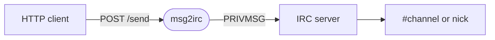

# msg2irc

[](https://opensource.org/licenses/MIT)
[](https://golang.org)

HTTP-to-IRC bridge. POST a JSON payload, it shows up as a PRIVMSG.

Runs as a persistent IRC bot on your server. Put it behind a reverse proxy and you can hit it from anywhere — phone shortcuts, monitoring alerts, scripts, webhooks.

---

## How it works



---

## Build

```bash
git clone https://github.com/joehonkey/msg2irc
cd msg2irc
go build -o msg2irc .
```

FreeBSD cross-compile:

```bash
GOOS=freebsd GOARCH=amd64 go build -o msg2irc .
```

---

## Configuration

```yaml
listen_addr: "127.0.0.1:8080"
token: "your-secret-token"

tls:
  mode: "off"        # off | auto | manual
  domain: ""
  cert: ""
  key: ""
  listen_addr: ":443"
  cache_dir: "./certs"

irc:
  server: "irc.example.com"
  port: 6697
  nick: "msg2irc"
  tls: true
  tls_hostname: "irc.example.com"
  channels:
    - "#yourchannel"
```

### TLS modes

| Mode | Description |
|------|-------------|
| `off` | Plain HTTP on `listen_addr`. Reverse proxy handles HTTPS. |
| `auto` | Let's Encrypt. Needs ports 80 and 443. |
| `manual` | Your own cert and key files. |

---

## Running

```bash
./msg2irc -config config.yaml
```

FreeBSD rc.d:

```bash
sudo cp contrib/freebsd/msg2irc /usr/local/etc/rc.d/msg2irc
sudo sysrc msg2irc_enable=YES
sudo service msg2irc start
```

---

## Sending a message

```bash
curl -X POST https://your-server.example.com/msg2irc/send \
  -H "Content-Type: application/json" \
  -d '{"target":"#chan","message":"hello","token":"your-secret-token"}'
```

| Field | Required | Notes |
|-------|----------|-------|
| `target` | yes | `#channel` or nick |
| `message` | yes | Text to send |
| `from` | no | Prefixed as `from: message` |
| `token` | yes | Must match config |

---

## Reverse proxy

**Apache** — inside your HTTPS VirtualHost:

```apache
ProxyPass        "/msg2irc/"  "http://127.0.0.1:8080/"
ProxyPassReverse "/msg2irc/"  "http://127.0.0.1:8080/"

<Proxy "http://127.0.0.1:8080/">
    Require all granted
</Proxy>
```

**nginx:**

```nginx
location /msg2irc/ {
    proxy_pass http://127.0.0.1:8080/;
}
```

---

## Phone

[HTTP Shortcuts](https://http-shortcuts.rmy.ch/) (Android) works well. Set up a POST shortcut, add a `message` variable with type **Text Input**, and you get a prompt each time you tap it.

---

## Security

Keep `token` secret — it's the only thing protecting the endpoint. Always run behind HTTPS. If using a proxy, bind `listen_addr` to `127.0.0.1`.

---

## License

MIT
